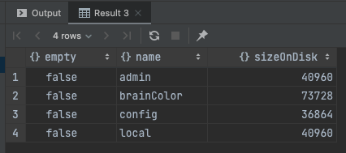
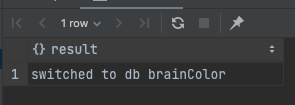
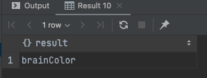
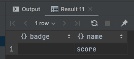
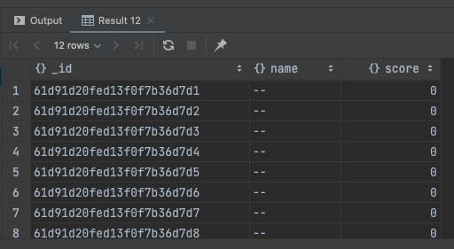

오늘은 제가 길벗의 가장 빨리 만나는 스벨트의 마지막 장을 따라하다보니, `MongoDB`에 대한 부분이 존재하여 제가 사용한 부분을 정리하려고 합니다.

## 사용하는 방법

- 사용하는 방법은 제가 아는 방법으로는 2가지 방법이 존재합니다.
  - mongodb 사이트에서 제공하는 cloud 사용
  - 컴퓨터에 설치하여 사용하는 방법

### mongodb 사이트에서 제공하는 cloud 사용

- 이 방법은 https://www.mongodb.com/ 사이트를 통해서 가입 및 로그인 하여 사용하는 방법입니다. 일부 사용에 대해서는 무료를 제공하고 있으니 확인해 보시기 바랍니다.

### 컴퓨터에 설치하여 사용하는 방법

- 직접 컴퓨터의 설치를 하거나, 저의 경우에는 docker를 개인적으로 사용하고 있기 때문에 docker를 통해서 설치하였습니다.

- **docker를 통한 설치방법**
  - docker image는 mongo를 사용합니다.
  - docker 내의 명칭은 <이름>으로 만들겠습니다.
  - 컨테이너 안의 27017포트를 외부에서도 27017로 사용하겠습니다.
  - 컨테이너 안의 /data/db는 `<pc 내 데이터베이스를 저장할 절대경로>` 디렉토리를 사용하겠습니다.

```shell
docker run --name <이름> -v <pc 내 데이터베이스를 저장할 절대경로>:/data/db -d -p 27017:27017 mongo
```

## MongoDB의 데이터 구조

- `Database` : Collection의 물리적 컨테이너입니다.
- `Collection` : RDBMS에서의 table이라고 생각하면 됩니다.
- `Document` : MongoDB는 NOSQL로 불리고 있습니다. 이는 Document Oriented Database라고도 합니다. 즉, 한개 이상의 key-value 쌍으로 이루어진 구조를 의미합니다.
- `Key/Field` : 일반 RDBMS에서 COLUMN이라 생각하면 됩니다.

## MongoDB 의 명령어

- `show dbs` : 데이터베이스 리스트들을 확인할 수 있습니다.
  
- `use <database명>` : 데이터베이스를 사용하겠다라는 의미힙니다. 더불어, Database가 없을 시에는 생성이 됩니다.
  
- `db` : 현재 내가 사용하는 Database를 확인할 수 있다.
  
- `db.createCollection("<Collection명>")` : 현재 사용하는 database에 name으로 Collection을 생성할 수 있다.

  - 참고로, createCollection에는 capped, autoIndex, size, max등의 option이 존재합니다.

- `show collection` : Collection을 생성한 내역을 확인하기 위해서 사용합니다.
  
- `db.score.find()` : Collection에 있는 내용을 확인하기 위해서 사용합니다.
  

- 이 외에도 입력, 제거, 삭제등의 명령어가 존재합니다.
- 이 부분은 https://docs.mongodb.com/manual/ 이 사이트를 확인하시기 바랍니다.

## 주의사항

- 저의 경우에는 스터디용으로 사용하였던 것으로 인증 부분을 확인하지 않았습니다. 추후, 이 부분도 한번 알아보도록 하겠습니다.
