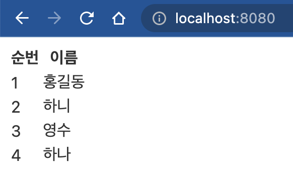

## Svelte 프로젝트를 만드는 방법

- 첫번째 방법은 sveltejs에서 만들어 놓은 템플릿을 가지고 시작하는 방법입니다.

```shell
npx degit sveltejs/template <project명>
```

> **degit** : https://www.github.com/sveltejs/template 을 쉽게 가져올 수 있도록 명령어에 대한 alias를 준 느낌이 나기도 합니다. 현재도 git clone https://www.github.com/sveltejs/template <project명> 을 통해서 폴더를 생성하였다면, 위와 같이 간단히 표현하여 repository 위치만 안다면 쉽게 가져올 수 있도록 개선된 느낌입니다.

- 두번째 방법으로 Svelte로 구동되는 애플리케이션 프레임워크로 시작하는 방법입니다.

```shell
npm init svelte@next <project명>
```

> sveltekit의 경우에는 현재(2022.01.07)에도 정식버젼으로 출시가 되어 있지 않습니다. 이에, 정식버젼이 출시되기 전까지는 계속적인 변경이 있을 것이라고 판단됩니다.

## Svelte 의 특징

- 적은 코드
- 순수한 리액티비티(반응형)
  - 스벨트 공식 사이트에서는 `Truly reactive` 정의하고 있습니다.

## Svelte 파일의 형식

- 스벨트 파일은 다음과 같은 형식으로 표현됩니다.

  - 확장자는 **.svelte**로 끝나게 됩니다.
  - 파일 안의 내용은 다음과 같습니다.

    ```html
    <!-- 자바스크립트 코드 -->
    <script>
      스크립트 블록
    </script>

    <!-- HTML 코드 -->
    <main>
      HTML 블록
    </main>

    <!-- CSS 코드 -->
    <style>
      스타일 블록
    </style>
    ```

> 중요점 : 순수한 리액티비티(반응형)을 사용하기 위해서는 반드시 할당 연산자(=)을 사용해야 합니다.

## 템플릿 기본 표현식

### if 블록

```html
{#if} {:else if} {/if}
```

- 예시

```html
<script>
  let number = 0
</script>

<input type="number" bind:value="{number}" />

{#if number > 10}
<h4>현재 숫자는 10보다 크며, {number} 입니다.</h4>
{:else}
<h4>숫자가 1~9 사이이며, {number} 입니다.</h4>
{/if}
```

- 결과

|            10 보다 작을 때             |              10 이상일 떄              |
| :------------------------------------: | :------------------------------------: |
|  |  |

### each 블록

```html
{#each array as item, index} {/each}
```

- 예시

```html
<script>
  let names = ['홍길동', '하니', '영수', '하나']
</script>

<table>
  <thead>
    <th>순번</th>
    <th>이름</th>
  </thead>
  <tbody>
    {#each names as item, index}
    <tr>
      <td>{index + 1}</td>
      <td>{item}</td>
    </tr>
    {/each}
  </tbody>
</table>
```

- 결과
  

> 참고 : json을 object로 만들시에는 Object.entries(<json 객체>)를 사용합니다.

### Promise를 위한 await 블록

```
{#await}
  // 동작 중일 때 처리
{:then res}
  // 정상 종료 후 처리
{:catch error}
 // 에러일 때 처리 {/await}
```

- 예시

```html
<script>
  async function promise() {
    const result = new Promise((resolve, reject) => {
      setTimeout(() => {
        resolve('hello')
      }, 1000)
    })
    const rtn = await result
    return rtn
  }
</script>

{#await promise()}
<h1>잠시만 기다리세요</h1>
{:then res}
<h1>데이터는 {res} 입니다.</h1>
{:catch error}
<h1>error: {error}</h1>
{/await}
```

|                     최초                     |                    1초후                     |
| :------------------------------------------: | :------------------------------------------: |
|  |  |

> 위 화면을 보시면 최초에는 `#await` 구문 안에 있는 문구를, 1초 후에는 `then` 안의 문구를 표출하게 됩니다.

### 부분 rerendering

```
{#key <변수명>}
  // 변수의 값이 변경될 때마다 rerendering 될 수 있도록 하는 코디
{/key}
```

- 예시

```html
<script>
  let name = 'angeloper'
</script>
<input type="text" bind:value="{name}" />

<p>{Date()}</p>

{#key name}
<p>{Date()}</p>
<p>{name}</p>
{/key}
```

- 결과

  |               초기 세팅시                |           이름을 변경하였을 시           |
  | :--------------------------------------: | :--------------------------------------: |
  |  |  |

  > 위 화면을 보시면 `key`로 감싼 부분만 rerendering이 되어지고, `key` 위에 있는 사항은 변경이 되지 않은 것을 확인할 수 있습니다.

### html 출력

```
{@html <변수명>}
```

- 예시

```html
<script>
  let testString = '<b><font color="red">안녕하세요.</font></b>'
</script>

<main>
  {@html testString}
</main>
```

- 결과
  

### debuging

```html
{@debug <변수명>}
```

### reactive programing

```
`$:` 을 사용하여 반응성을 극대화 처리
```
